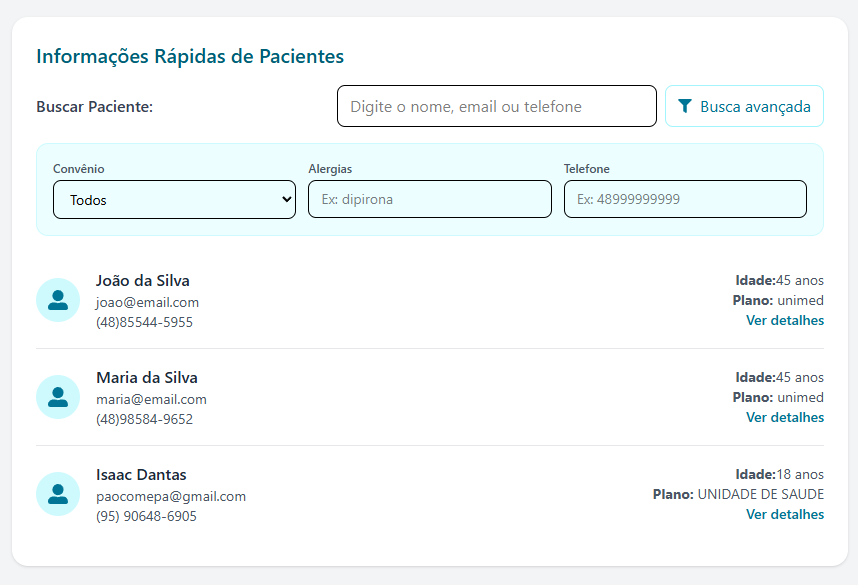
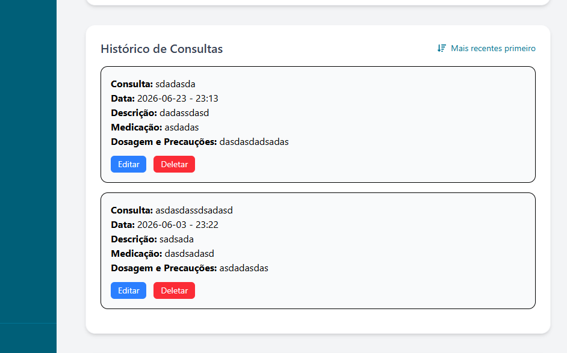
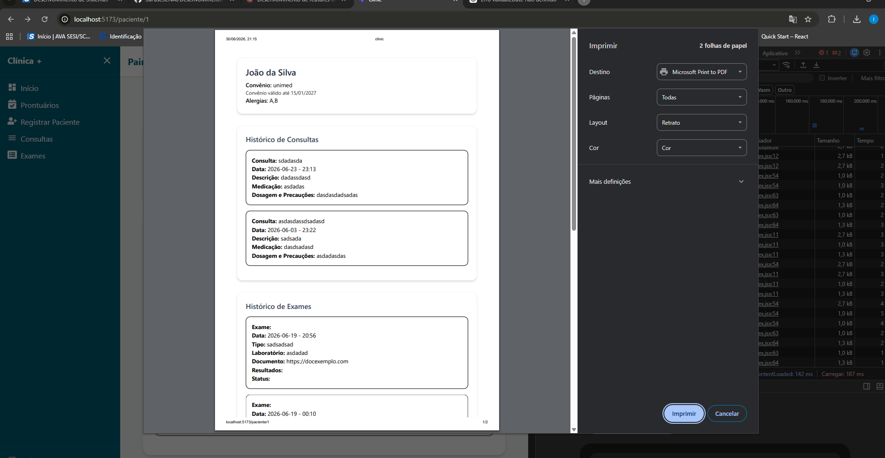
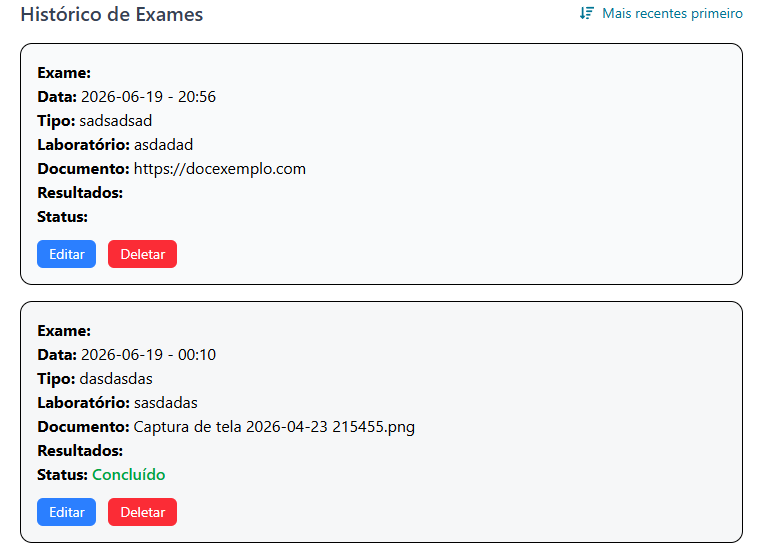

# Relatório de Implementação de Features
## Projeto Clínica+

**Aluno:** Isaac Dantas  
**Disciplina:** Desenvolvimento de Sistemas  
**Projeto:** Clínica+ (React + Vite + JSON Server)

---

# Ferramentas utilizadas

Durante o desenvolvimento das melhorias foram utilizadas as seguintes ferramentas:

| Ferramenta | Finalidade |
|------------|------------|
| ChatGPT (OpenAI) | Auxílio na implementação das funcionalidades, correção de bugs e documentação. |
| Claude (Anthropic) | Apoio na análise do código, sugestões de implementação e validações. |
| React | Desenvolvimento da interface. |
| Tailwind CSS | Estilização dos componentes. |
| Axios | Comunicação com a API (JSON Server). |
| React Toastify | Mensagens de sucesso e erro. |
| React Icons | Ícones utilizados na interface. |

---

# Features implementadas

Foram desenvolvidas três funcionalidades propostas na atividade e uma funcionalidade inédita.

---

# 1. Sistema de Busca Avançada

Foi implementado um sistema de filtros para facilitar a localização de pacientes.

Os filtros adicionados foram:

- Convênio
- Alergias
- Telefone

Os filtros podem ser utilizados juntamente com a busca por nome, permitindo localizar pacientes de forma muito mais rápida.

## Principais pontos do código

- Utilização de múltiplos `.filter()`
- Geração dinâmica dos convênios usando `useMemo`
- Normalização do telefone removendo caracteres especiais antes da comparação

```jsx
const filteredPatients = patients
    .filter(...)
    .filter(...)
    .filter(...)
```

## Resultado



---

# 2. Ordenação de Consultas e Exames

Foi criada uma ordenação para os históricos de consultas e exames.

O usuário pode alternar entre:

- Mais recentes primeiro
- Mais antigos primeiro

A ordenação considera tanto a data quanto o horário do atendimento.

## Principais pontos

Foi utilizado:

- useMemo
- função de comparação
- parse das datas antes da ordenação

```jsx
const sortedConsults = useMemo(() => {
    ...
}, [consults, consultsOrder])
```

## Resultado



---

# 3. Exportação do Prontuário em PDF

Foi criado um botão que permite exportar todo o prontuário do paciente.

A solução foi implementada utilizando o próprio navegador através da função:

```javascript
window.print()
```

Com CSS específico para impressão foi possível ocultar menus e botões, deixando apenas o prontuário.

## Principais pontos

- utilização do `window.print()`
- criação do CSS `@media print`
- impressão apenas da área do prontuário

## Resultado



---

# 4. Nova Feature — Status do Exame

Além das funcionalidades propostas, foi criada uma nova funcionalidade.

Cada exame agora possui um **Status**, permitindo identificar rapidamente sua situação.

Exemplos:

- Concluído
- Pendente
- Em andamento

O status é exibido diretamente na tela de histórico dos exames.

Essa funcionalidade facilita o acompanhamento dos exames pelos profissionais da clínica.

## Principais pontos

Foi adicionado um novo campo:

```json
status
```

Esse campo é exibido junto às demais informações do exame.

## Resultado



---

# Correções realizadas durante o desenvolvimento

Além das novas funcionalidades, foram corrigidos alguns problemas encontrados no projeto.

## Cadastro de consultas

Foi corrigida uma condição que impedia o salvamento das consultas.

Antes:

```javascript
if (selectedPatient) return;
```

Depois:

```javascript
if (!selectedPatient) return;
```

---

## Cadastro de pacientes

Foi corrigido o erro da função `validateDate`, que estava sendo utilizada fora do escopo.

Também foi reorganizada a validação da data de nascimento.

---

## Cadastro de exames

Foi corrigido o armazenamento do documento do exame.

Antes era salvo um objeto:

```json
documentUrl: {}
```

Agora é armazenado apenas o nome do arquivo:

```javascript
documentUrl: file.name
```

Isso eliminou o erro:

> Objects are not valid as a React child

---

# Considerações finais

As melhorias implementadas tornaram o sistema mais organizado e funcional.

Entre os principais benefícios obtidos estão:

- pesquisa mais eficiente dos pacientes;
- histórico organizado por ordem cronológica;
- exportação do prontuário em PDF;
- visualização rápida do status dos exames.

Além disso, foram corrigidos bugs que impediam o correto funcionamento de partes importantes da aplicação, aumentando sua estabilidade.

---

# Estrutura dos arquivos alterados

```
src/
│
├── components/
│   ├── PatientsList/
│   ├── PatientDetail/
│   └── RegisterExams/
│
├── utils/
│   └── date.js
│
└── index.css
```

---

# Tecnologias

- React
- Vite
- Tailwind CSS
- Axios
- JSON Server
- React Toastify
- React Icons
- ChatGPT
- Claude